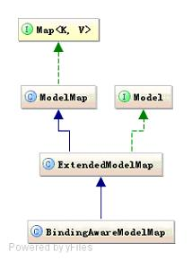
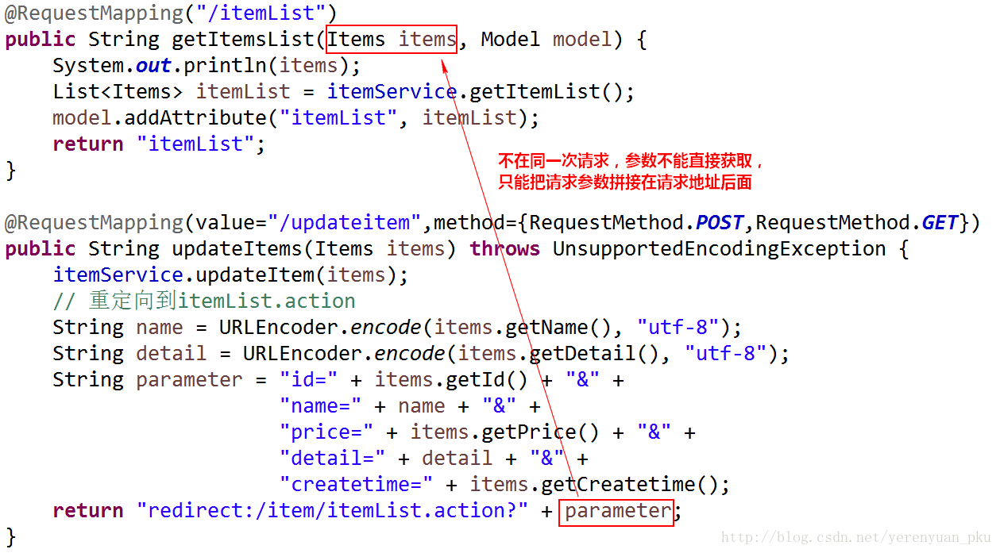
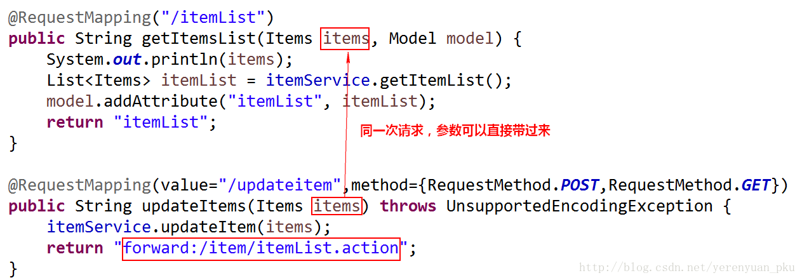

# Controller

## 入参

### 从请求url当中来的参数 

#### url占位符

使用`@PathVariable`注解(Spring专属),或者`@PathParam`注解(Java标准),从url中获取参数而对应映射的url需要使用占位符来表示

```java
@GetMapping("/test/{openId}/{name}")
public String test(@PathVariable("openId") Long openId,@PathVariable("name") String name ){
    // here we get openId,name from url placeHolder
    // 如果url为/test/11/li
    // 则openId=11, name=li
    return "test";
}
```

#### url的query部分

使用`RequestParam`注解(Spring专属),或者`QueryParam`注解(Java标准),从url的query部分(?后内容)获取参数，而对应的url映射,不需要像占位符那样列出入参的名字

```java
URL=/test?openId=11&name=li


@GetMapping("/test")
public String test(@RequestParam("openId") Long openId,@RequestParam("name") String name){
    //here we get openId, name from url
    // 如果url为/test?openId=11&name=li
    // 则openId=11, name=li
    
    // 如果不确定url是否有openId, 可以
    // @RequestParam(value="openId", required=false)
    // 这样就不会因为匹配不上而报错
    
    return "test";
}


@GetMapping("/test")
public String test(Long openId, String name){ // 可以不写@RequestParam，不过变量名要和query部分一致
    //here we get openId, name from url
    // 如果url为/test?openId=11&name=li
    // 则openId=11, name=li
    
    // 如果不确定url是否有openId, 可以
    // @RequestParam(value="openId", required=false)
    // 这样就不会因为匹配不上而报错
    
    return "test";
}
```

#### 从url中组装对象入参

**自定义对象绑定规则**

- 自定义对象符合JavaBean规范

  - JavaBean 类必须是一个公共类，并将其访问属性设置为 public  ，如： public class user{......}

  - JavaBean 类必须有一个空的构造函数：类中必须有一个不带参数的公用构造器

  - 一个javaBean类不应有公共实例变量，类变量都为private  ，如： private int id;

  - 属性应该通过一组存取方法（getXxx 和 setXxx）来访问，一般是IDE(Eclipse、JBuilder) 为属性生成getter/setter 方法

  - | 属性名/类型        | getter 方法                    | setter 方法                                 |
    | ------------------ | ------------------------------ | ------------------------------------------- |
    | xcoordinate/Double | public Double getXcoordinate() | public void setXcoordinate(Double newValue) |
    | xCoordinate/Double | public Double getxCoordinate() | public void setxCoordinate(Double newValue) |
    | XCoordinate/Double | public Double getXCoordinate() | public void setXCoordinate(Double newValue) |
    | Xcoordinate/Double | 不允许                         | 不允许                                      |

- 请求的url的路径占位符部分(上面提到的url参数第一种)和query部分(上面提到的url参数第二种),参数名和自定义对象的属性名一致 

```java
// /test/111?fromSite=111 
@GetMapping("/test/{openId}")
public String test(Pojo pojo){
    //here we get a pojo instance with openId and fromSite
    return "test";
}
 
class Pojo{
    private Long openId;
    private String fromSite;
 
    public Long getOpenId() {
        return openId;
    }
 
    public void setOpenId(Long openId) {
        this.openId = openId;
    }
 
    public String getFromSite() {
        return fromSite;
    }
 
    public void setFromSite(String fromSite) {
        this.fromSite = fromSite;
    }
}
```


### 从Session中来的参数 

#### 获取所有HttpSession

自由度很大的一种方式,可以操作所有存放在Session中的对象

```java
@GetMapping("/test")
public String test(HttpSession session){
    //here we get HttpSession,just write HttpSession session in param
    return "test";
}
```

#### 获取Session中指定的对象

只能获得先前存在Session中的指定的对象,如果指定的对象不存在,则会返回400 bad request.如果指定对象的类型和Session中存放的对象类型不一致,则会报类型转化的异常

```java
@GetMapping("/test")
public String test(@SessionAttribute("pojo") Pojo pojo){
    //here we get pojo from Session
    return "test";
}
```


### 从Cookie中来的参数 

从Cookie中取得参数,相比于Session,就显得简单粗暴了,只有一种方式,只能读取,不能设置,如果要设置,需要入参传入HttpServletRequest和HttpServletResponse设置

```java
@GepMapping("/test")
public String test(@CookieAttribute("test") String test/*cookie 只能存放String*/){
    //here we get String test from cookie
    return "test";
}
```


### 用于前后端传递数据的Map(例如`ModelAndView`) 

Map这个入参,其实也是很灵活的,相关的类有三个:Map,Model,ModelMap



此外还有一个ModelAndView类,这个类也有前后台传递数据的功能,甚至还有决定页面的功能,不过这个类和Map,Model,ModelMap并不同源,当这个类和Map,Model.ModelMap一起使用,并且增添同名数据的时候,ModelAndView的优先级更高,会覆盖其他同名数据

```java
@RequestMapping(value = "/mergeModel")
public ModelAndView mergeModel(Model model) {
    model.addAttribute("a", "a");//①添加模型数据
    ModelAndView mv = new ModelAndView("success");
    mv.addObject("a", "update");//②在视图渲染之前更新③处同名模型数据
    model.addAttribute("a", "new");//③修改①处同名模型数据
    //视图页面的a将显示为"update" 而不是"new"
    return mv;
}
```

**后台存值和前台取值**

```java
[ModelAndView] 
addObject(String attributeName,Object attributeValue);
addAllObject(Map<String,?> modelMap);

[Model]
model.addAttribute（"person", person）

[Map]
put(String attributeName,Object attributeValue);

// JSP页面取值
${requestScope.key}
```


### HttpServletRequest和HttpServletResponse 

当你想拥有和操作Servlet一样的自由度的时候,可以尝试路由处理函数中传入HttpServletRequest和HttpServletResponse. 

```java
@GepMapping("/test")
public String test(HttpServletRequest request,HttpServletResponse response){
    //here we get HttpServletRequest and HttpServletResponse,we can do something with request and response
    //有没有觉得这个方法和Servlet的doGet和doPost很像了
    //比如,我们实践一下在 **从Cookie中来的参数** 中提到的,增加Cookie的操作
    Cookie cookie=new Cookie("test","this is a test Cookie");
    cookie.setPath("/");
    cookie.setMaxAge(-1);//代表页面关闭即销毁Cookie
    response.addCookie(cookie);
    return "test";
}
```


保存数据到作用范围域，Spring MVC更推荐使用WebRequest

```java
webRequest.setAttribute(key(String), value(Object), [RequestAttributes.SCOPE_REQUEST | RequestAttributes.SCOPE_SESSION](int))
```


### 其他不常用的类型,比如InputStream/OutputStream 和 Reader/Writer,WebRequest/NativeWebRequest


## 返回值

### 返回ModelAndView

Controller类方法中定义ModelAndView对象并返回，对象中可添加model数据、指定view

等同于返回`modelAndView.getViewName`字符串


### 返回void

在Controller类方法形参上可以定义request和response，使用request或response指定响应结果

1. 使用request转向页面，如下：

   ```
   request.getRequestDispatcher("页面路径").forward(request, response);
   ```

   之前我们实现商品列表的查询，返回的是ModelAndView，如果现在该方法的返回值是void，那么就应使用request跳转页面，如下：

   ```java
   @RequestMapping("/itemList2")
   public void itmeList2(HttpServletRequest request, HttpServletResponse response) throws Exception {
       // 查询商品列表
       List<Items> itemList = itemService.getItemList();
       // 向页面传递参数
       request.setAttribute("itemList", itemList);
       // 如果使用原始的方式做页面跳转，必须给的是jsp的完整路径
       request.getRequestDispatcher("/WEB-INF/jsp/itemList.jsp").forward(request, response);
   }
   ```

   <font color='red'>如果使用原始的方式做页面跳转，必须给的是jsp的完整路径</font>

2. 也可以通过response实现页面重定向：

   ```java
   response.sendRedirect("url");
   ```

3. 也可以通过response指定响应结果，例如响应json数据如下：

   ```java
   response.setCharacterEncoding("utf-8");
   response.setContentType("application/json;charset=utf-8");
   response.getWriter().write("json串");
   ```


### 返回字符串

#### 逻辑视图名

Controller类方法返回字符串可以指定逻辑视图名，通过视图解析器解析为物理视图地址

即 `默认前缀+字符串+默认后缀`拼接成完整路径

<font color='red'>直接访问页面，不经过Controller</font>

#### Redirect重定向

<font color='red'>重定向到Controller</font>

Contrller类方法返回结果重定向到一个url地址，如下商品信息修改提交后重定向到商品查询方法，参数无法直接带到商品查询方法中。

```java
@RequestMapping(value="/updateitem",method={RequestMethod.POST,RequestMethod.GET})
public String updateItems(Items items) {
    itemService.updateItem(items);
    // '/'是不包含工程名的根目录，即http://localhost:8080/springmvc-web2/item/itemList.action
    return "redirect:/item/itemList.action";
}
```

redirect方式相当于“response.sendRedirect()”，转发后浏览器的地址栏变为转发后的地址，因为转发即执行了一个新的request和response。由于新发起一个request，原来的参数在转发时就不能传递到下一个url，如果要传参数可以在/item/itemList.action后边加参数，如下：

```java
return "redirect:/item/itemList.action?id=xxx&name=xxx";
```



==但如果你使用的是Model接口，那么SpringMVC框架会自动将Model中的数据拼装到`/item/itemList.action`后面。== <font color='red'>?????</font> 可能是因为我测试时用的不是JSP，而是HTML

#### forward转发

<font color='red'>转发到Controller</font>

Controller类方法执行后继续执行另一个Controller类方法，如下商品修改提交后转向到商品修改页面，修改商品的id参数可以直接带到商品修改方法中。

```java
@RequestMapping(value="/updateitem",method={RequestMethod.POST,RequestMethod.GET})
public String updateItems(Items items) throws UnsupportedEncodingException {
    itemService.updateItem(items);
    return "forward:/item/itemList.action";
}
```

forward方式相当于“request.getRequestDispatcher().forward(request,response)”，转发后浏览器地址栏还是原来的地址。转发并没有执行新的request和response，而是和转发前的请求共用一个request和response。所以转发前请求的参数在转发后仍然可以读取到。




## 作用范围域——page、request、session、application

| 内置对象    | 类型                                                         | 作用域      |
| ----------- | ------------------------------------------------------------ | ----------- |
| pageContext | javax.servlet.jsp.pageContext                                | page        |
| request     | javax.servlet.http.HttpServletRequest                        | request     |
| response    | javax.servlet.http.HttpServletResponse                       | page        |
| session     | javax.servlet.http.HttpSession                               | session     |
| application | javax.servlet.ServletContext                                 | application |
| config      | javax.servlet.ServletConfig                                  | page        |
| out         | [Java](http://lib.csdn.net/base/javase).servlet.jsp.JspWriter | page        |
| page        | java.lang.Object                                             | page        |
| exception   | java.lang.Throwable                                          | page        |


### 保存数据到作用域

```java
//HttpServletRequest request, HttpSession session
// request
request.setAttribute(key(String), value(Object));
// session
session.setAttribute(key(String), value(Object));
// application
request.getServletContext().setAttribute(key(String), value(Object));
session.getServletContext().setAttribute(key(String), value(Object));

/* Spring MVC推荐做法 */
// WebRequest webRequest
// request
webRequest.setAttribute(key(String), value(Object),RequestAttributes.SCOPE_REQUEST(int));
// session
webRequest.setAttribute(key(String), value(Object),RequestAttributes.SCOPE_SESSION(int));
```


## @RequestMapping和@GetMapping @PostMapping 区别

- @GetMapping是一个组合注解，是@RequestMapping(method = RequestMethod.GET)的缩写
- @PostMapping是一个组合注解，是@RequestMapping(method = RequestMethod.POST)的缩写


被`@bean`标注的方法会被注册成`bean`，如果调用该方法，就会在bean仓库中查找。